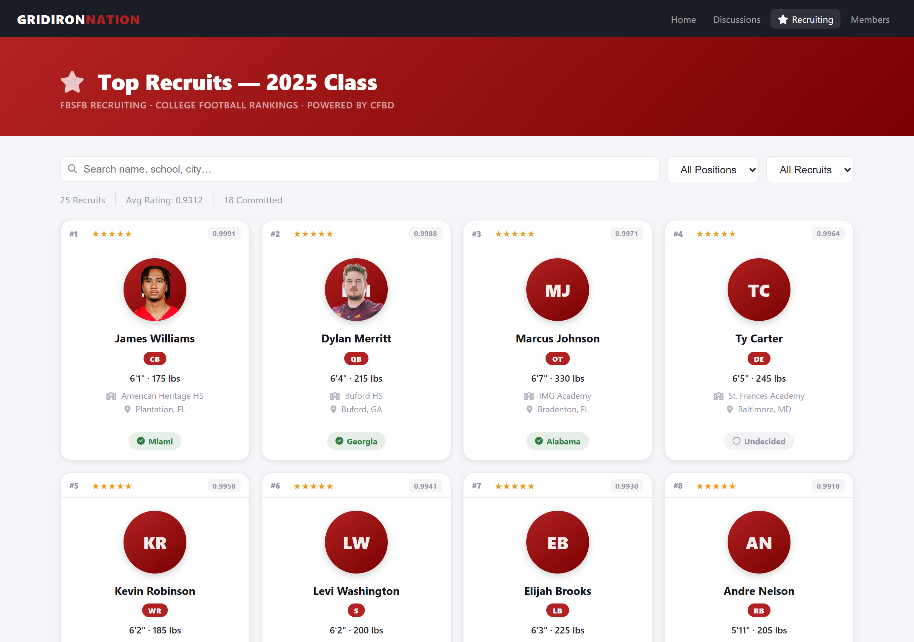
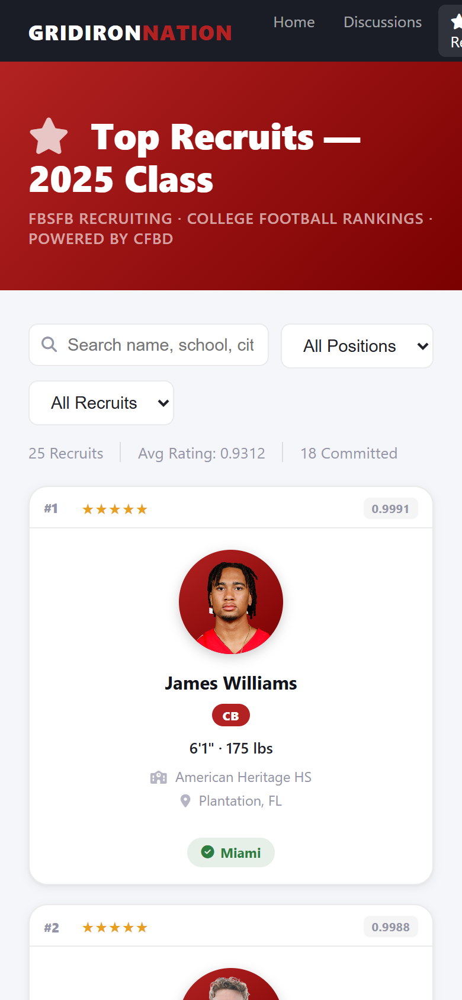

# FBSFB Recruiting

[](https://floxum.com/extension/ernestdefoe/recruiting)
[](https://floxum.com/extension/ernestdefoe/recruiting)
[](https://floxum.com/extension/ernestdefoe/recruiting)
[](https://floxum.com/extension/ernestdefoe/recruiting)
[](https://floxum.com/extension/ernestdefoe/recruiting)

A Flarum 2 extension that pulls live college football recruiting rankings from the [College Football Data API](https://collegefootballdata.com/) and displays them on a dedicated `/recruiting` page inside your Flarum forum.



---

## Features

- **Live data** — recruiting rankings pulled directly from the CFBD API and cached server-side
- **Player headshots** — automatically sourced from On3's football rankings page; falls back to a star-tier coloured initials avatar when no photo is available
- **Full player details** — national rank, star rating, numerical rating, position, height, weight, high school, hometown, and commitment status
- **Filters** — search by name / school / city, filter by position, filter by committed vs. undecided
- **Stats bar** — total recruits displayed, average rating, committed count
- **Responsive grid** — adapts from 4–5 columns on desktop down to 2 on mobile

| Mobile view |
|---|
|  |

---

## Requirements

- Flarum 2.x
- PHP 8.3+
- A free CFBD API key from [collegefootballdata.com](https://collegefootballdata.com/)
- `guzzlehttp/guzzle` ^7.0 (pulled in automatically via Composer)

---

## Installation

```bash
composer require ernestdefoe/recruiting
php flarum migrate
php flarum cache:clear
```

Then enable the extension in **Admin → Extensions**.

---

## Configuration

All settings are found in **Admin → Extensions → FBSFB Recruiting**.

| Setting | Description | Default |
|---|---|---|
| **API Key** | Your CFBD bearer token | *(required)* |
| **Recruiting Year** | Class year to display (e.g. `2026`) | Current calendar year |
| **Team Filter** | Show only recruits committed to a specific team (e.g. `Alabama`). Leave blank for national rankings. | *(blank — national)* |
| **Page / Widget Title** | Heading shown above the widget and on `/recruiting`. Leave blank for "Top Recruits". | *(blank)* |
| **Max Recruits** | How many recruits to display (1–100) | `25` |
| **Cache Duration** | Soft TTL for CFBD responses (minutes). After this expires the next request serves the cached data and dispatches a background refresh — see [Caching & refresh strategy](#caching--refresh-strategy). | `360` (6 hours) |

---

## How it works

1. A forum member navigates to `/recruiting` (or clicks the **Recruiting** link in the sidebar nav).
2. The JS frontend calls the internal API route `GET /api/cfbd-recruits`.
3. The PHP controller reads your admin settings and checks Flarum's cache. If the cached payload is fresh it returns immediately. If it's past the soft TTL it dispatches a background refresh job and returns the cached (stale) data immediately — see [Caching & refresh strategy](#caching--refresh-strategy).
4. The refresh job (`RefreshRecruitsJob`) proxies a request to `https://api.collegefootballdata.com/recruiting/players?year=…&team=…`, sorts results by national ranking, transforms them into the JSON shape, and writes the new payload back to the cache envelope.
5. Recruit records are enriched with On3 headshots (see below) and returned to the client.
6. Player cards are rendered with national rank, stars, headshot, physical measurements, high school, hometown, and commitment pill.
7. Client-side filters let users narrow by position, commitment status, or keyword search instantly without a second API call.

---

## Caching & refresh strategy

The extension uses a **stale-while-revalidate** cache envelope so a CFBD round-trip (≤ 10 s) never blocks the user's request.

### Cache shape

```
ernestdefoe-recruiting.<hash> → { data: [...], fetched_at: <unix ts> }
```

- **Hard retention:** 7 days. Stale data is still served if every refresh attempt fails — better than a blank widget during a CFBD outage.
- **Soft TTL:** the **Cache Duration** setting (default 6 hours). Determines when a request is treated as stale and triggers a background refresh.

### Refresh paths

| State | Behaviour |
|---|---|
| Fresh cache (within soft TTL) | Return cached data. No network. |
| Stale cache, no refresh in flight | Dispatch `RefreshRecruitsJob`, return cached data immediately. A 90 s "refreshing" lock prevents N concurrent requests from dispatching N jobs in a stampede. |
| Stale cache, refresh already in flight | Return cached data immediately. The in-flight job will repopulate the cache for the next visitor. |
| No cache at all (first request ever, or `cache:clear`) | Inline CFBD fetch. This is the ONE request that pays the API round-trip on the request thread. |

### Recommended: run a queue worker

By default Flarum 2 ships with the **`sync` queue driver**, which means `RefreshRecruitsJob::dispatch()` runs inline in the request — defeating the point of the stale-while-revalidate pattern (one unlucky stale request per soft-TTL window still pays the CFBD cost).

For zero-wait refresh, configure a real queue driver in `config.php`:

```php
'queue' => [
    'driver' => 'database',     // or 'redis', 'sqs', etc.
],
```

…then run a queue worker (typically under supervisor / systemd):

```bash
php flarum queue:work --tries=3 --timeout=60
```

With a real driver the dispatch returns in <1 ms and the worker handles the CFBD fetch in the background. Every request — even the first one after the soft TTL expires — gets cached data instantly.

---

## Player headshots

Headshots are sourced from **[On3](https://www.on3.com/)**, which maintains photos for thousands of current and historical high-school recruits.

### How the image lookup works

On3's football rankings page (`on3.com/rivals/rankings/player/football/{year}/`) is fully server-rendered HTML containing 150+ ranked recruits, each with a profile link and headshot image URL embedded directly in the markup.

On the first API call after the cache is empty the extension:

1. Fetches the On3 rankings page for the configured class year (one HTTP request).
2. Parses the HTML to build a **name → image URL** map using positional matching between profile hrefs (`/rivals/jared-curtis-159433/`) and `on3static.com` image paths.
3. Caches the map for **24 hours** — subsequent requests read from cache with zero external HTTP calls.
4. Matches each CFBD recruit to the map by normalised name slug (e.g. `"Jared Curtis"` → `"jared-curtis"`).

### Fallback avatars

When no On3 photo is available the card shows a coloured initials avatar whose background is coded by star rating:

| Stars | Colour |
|---|---|
| ★★★★★ | Gold |
| ★★★★ | Blue |
| ★★★ | Green |
| ★★ / unrated | Slate |

---

## Player card data

Each card displays:

- **National ranking** (`#1`, `#2`, …)
- **Star rating** (★★★★★) and **numerical rating** (e.g. `0.9991`)
- **Headshot** — sourced from On3; coloured initials avatar as fallback
- **Name** and **position** (QB, WR, CB, OT, DE, …)
- **Height · Weight** (e.g. `6'3" · 215 lbs`)
- **High school** name
- **Hometown** (City, State)
- **Commitment pill** — `✔ Georgia` (green) or `○ Undecided` (grey)

---

## Data sources

| Data | Source |
|---|---|
| Rankings, ratings, recruit details | [College Football Data API](https://collegefootballdata.com/) |
| Player headshots | [On3](https://www.on3.com/) rankings page |

CFBD provides a free API key with generous rate limits. The extension caches all external responses to minimise outbound requests.

---

## Support

Questions, bug reports, and feature requests:

- **Support forum:** https://ernestdefoe.online
- **Issues:** https://github.com/ernestdefoe/recruiting/issues

## License

MIT
